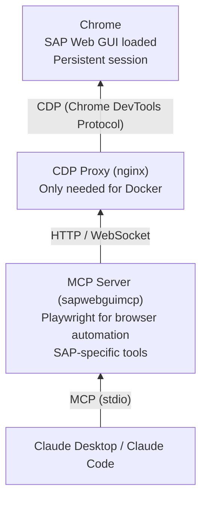
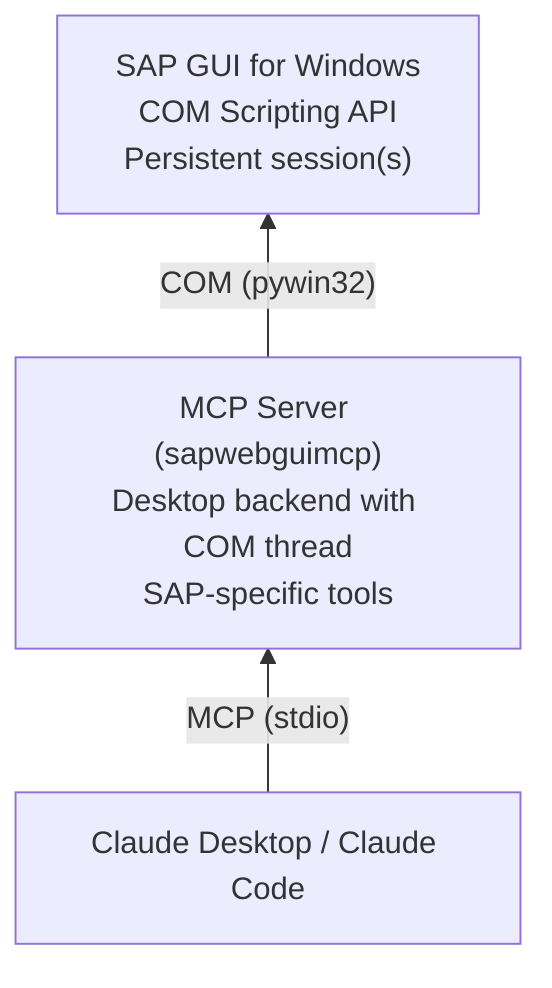

# SAP MCP Server

[](https://github.com/Hochfrequenz/sapwebgui.mcp/actions)
[](https://github.com/Hochfrequenz/sapwebgui.mcp/actions)
[](https://github.com/Hochfrequenz/sapwebgui.mcp/actions)
[](https://github.com/Hochfrequenz/sapwebgui.mcp/actions)

An MCP (Model Context Protocol) server for SAP automation.
Control SAP through Claude Desktop or Claude Code — via **SAP GUI desktop** or **SAP Web GUI** (browser).
The MCP works with both SAP R/3 and S/4 (because some might even say "they are the same system" with just some different names and labels).

## Setup

Choose one of these three approaches:

**Where to register the MCP server:**

- **Claude Code** — add to `.mcp.json` in your project root (per-project config)
- **Claude Desktop** — add to `claude_desktop_config.json` (global config, path varies by OS — shown in each section below)

All three setup approaches below show you how to configure both.

> [!WARNING]
> **Special characters in passwords:** If your SAP password contains `"` or `\` characters, you must escape them in the JSON config files: `"` becomes `\"` and `\` becomes `\\`. For example, `pass"word` becomes `"pass\"word"` and `do\main` becomes `"do\\main"`. Unescaped special characters will silently break the JSON and the MCP server will fail to start.

> [!TIP]
> **Windows file extensions:** If file extensions are hidden in Windows Explorer, creating `.mcp.json` via right-click → New → Text File will produce `.mcp.json.txt` (or `.mcp.json.json` if you rename). Make sure "File name extensions" is checked in Explorer's View tab, then rename the file.

<details>
<summary><strong>📦 Standalone Executable (recommended — no Docker, no Python)</strong></summary>
<br>

Download `sapwebgui_mcp_windows_<version>.exe` from
[GitHub Releases](https://github.com/Hochfrequenz/sapwebgui.mcp/releases/latest).

Choose a backend:

|              | Desktop Backend (SAP GUI)            | WebGUI Backend (Browser)                     |
| ------------ | ------------------------------------ | -------------------------------------------- |
| **Platform** | Windows only                         | Windows, macOS, Linux                        |
| **Requires** | SAP GUI for Windows                  | Chrome browser                               |
| **Speed**    | Faster (works directly with SAP GUI) | Slower (works through a web browser)         |
| **Setup**    | Simpler (just SAP GUI + this tool)   | More steps (also needs Chrome browser setup) |

### Option A: Desktop Backend (SAP GUI) — recommended for Windows users

Automates SAP GUI directly — no browser needed. Windows only.
Uses [sapsucker](https://github.com/Hochfrequenz/sapsucker) for typed SAP GUI Scripting access.

**Prerequisites:**

- SAP GUI for Windows installed (standard path — the server finds it automatically via Windows registry)
- SAP GUI Scripting enabled (one-time setup, see below)

<details>
<summary>Enable SAP GUI Scripting (one-time)</summary>

**Server side** (requires admin/basis team):

- Transaction `RZ11` → parameter `sapgui/user_scripting` → set to `TRUE`
- Dynamic parameter — no server restart needed, but users must re-login (close and reopen SAP GUI)

**Client side** (your PC):

1. Open SAP Logon or any SAP GUI session
2. Go to **Options** (via menu bar, tray icon, or press **Alt+F12** in a session)
3. Navigate to **Accessibility & Scripting → Scripting** (DE: **Barrierefreiheit & Skripting → Skripting**)
4. Check **"Enable Scripting"** (DE: **"Skripting aktivieren"**)
5. Uncheck **"Notify when a script attaches to SAP GUI"**
6. Uncheck **"Notify when a script opens a connection"**

> [!IMPORTANT]
> The two notification checkboxes **must** be unchecked. If left checked, every COM connection triggers a modal popup that blocks automation.

</details>

#### Claude Desktop

Add to `claude_desktop_config.json`. To open the file: press **Win+R**, type `%APPDATA%\Claude`, press Enter. If `claude_desktop_config.json` does not exist, create a new text file with that exact name (make sure it ends in `.json`, not `.json.txt`).

> [!TIP]
> After downloading the `.exe`, note the full path. For example, if you saved `sapwebgui_mcp_windows_1.5.0.exe` to your Downloads folder, the path is `C:/Users/YourName/Downloads/sapwebgui_mcp_windows_1.5.0.exe`. Always use forward slashes (`/`) in the JSON, not backslashes (`\`).

```json
{
    "mcpServers": {
        "sap-desktop": {
            "command": "C:/path/to/sapwebgui_mcp_windows_<version>.exe",
            "env": {
                "BACKEND_TYPE": "desktop",
                "SAP_CONNECTION_NAME": "Your SAP Logon Entry",
                "SAP_USER": "your_username",
                "SAP_PASSWORD": "your_password",
                "SAP_MANDANT": "100",
                "SAP_LANGUAGE": "DE"
            }
        }
    }
}
```

#### Claude Code

Add to `.mcp.json` in your project root:

```json
{
    "mcpServers": {
        "sap-desktop": {
            "command": "C:/path/to/sapwebgui_mcp_windows_<version>.exe",
            "env": {
                "BACKEND_TYPE": "desktop",
                "SAP_CONNECTION_NAME": "Your SAP Logon Entry",
                "SAP_USER": "your_username",
                "SAP_PASSWORD": "your_password",
                "SAP_MANDANT": "100",
                "SAP_LANGUAGE": "DE"
            }
        }
    }
}
```

Replace:

- `Your SAP Logon Entry` with the **description** shown in SAP Logon — this is the bold text in the list when you open SAP Logon (e.g. `"HF S/4"` or `"DEV - ERP Development"`). It is _not_ the system ID or server address.
- `your_username` / `your_password` with your SAP credentials

#### Multi-system access (desktop backend only)

By default, the MCP server connects to one SAP system with one set of credentials. With multi-system access, the LLM can switch between different SAP systems and clients on the fly — useful when you work across DEV, QA, and PROD.

**How it works:**

1. `sap_list_connections` reads your SAP Logon entries (from `SAPUILandscape.xml`) to show which systems are available.
2. `sap_login(connection_name="QA System", client="200")` logs into a specific system and client, using credentials from `SAP_CREDENTIALS`.
3. `sap_discover_clients(connection_name="QA System")` opens a connection and queries table T000 to list all available clients (Mandanten) on that system. Requires SE16N authorization.

**Configuration:** Add `SAP_CREDENTIALS` to map connection names to their login credentials. Each system can have its own user/password:

```json
{
    "BACKEND_TYPE": "desktop",
    "SAP_CONNECTION_NAME": "HF S/4",
    "SAP_USER": "default_user",
    "SAP_PASSWORD": "default_password",
    "SAP_MANDANT": "100",
    "SAP_CREDENTIALS": "{\"DEV System\": {\"user\": \"dev_user\", \"password\": \"dev_pass\"}, \"QA System\": {\"user\": \"qa_user\", \"password\": \"qa_pass\"}}"
}
```

When `sap_login(connection_name="DEV System")` is called, it looks up the credentials in `SAP_CREDENTIALS`. If the system is not in the mapping, it falls back to `SAP_USER` / `SAP_PASSWORD`.

No Chrome, no browser setup required.

> **Getting started:** Save the config file, then restart Claude Desktop. Try asking: _"Log me into SAP"_ or _"Run transaction SE16"_. SAP GUI will open automatically if it is not already running.

### Option B: WebGUI Backend (Browser)

Automates SAP Web GUI through Chrome browser automation. Works on all platforms. This is the default — if you don't set `BACKEND_TYPE`, the server uses WebGUI.

#### Step 1: Start Chrome with remote debugging

```powershell
& "C:\Program Files\Google\Chrome\Application\chrome.exe" --remote-debugging-port=9222 --user-data-dir="C:\temp\chrome-debug" --ignore-certificate-errors
```

> [!NOTE]
> **Chrome path may differ.** The path above is for a system-wide Chrome installation. If Chrome was installed only for your user, the path is typically:
>
> ```powershell
> & "$env:LOCALAPPDATA\Google\Chrome\Application\chrome.exe" --remote-debugging-port=9222 --user-data-dir="C:\temp\chrome-debug" --ignore-certificate-errors
> ```
>
> Not sure where Chrome is installed? See [Finding your Chrome path](#finding-your-chrome-path) in the Troubleshooting section below.

#### Step 2: Configure your MCP client

**Required:** `SAP_URL`, `SAP_USER`, `SAP_PASSWORD`, `SAP_MANDANT`. All other variables are optional — remove any you don't need. See [Configuration Reference](#configuration-reference) for the full list.

> `GITHUB_PAT` is only needed for `log_feedback` (creates GitHub issues) or abapGit operations. Remove it if you don't need these features.

##### Claude Desktop

Add to `claude_desktop_config.json` (Windows: `%APPDATA%\Claude\claude_desktop_config.json`, macOS: `~/Library/Application Support/Claude/claude_desktop_config.json`):

```json
{
    "mcpServers": {
        "sap-webgui": {
            "command": "C:/path/to/sapwebgui_mcp_windows_<version>.exe",
            "env": {
                "SAP_URL": "https://your-sap-server/sap/bc/gui/sap/its/webgui",
                "SAP_USER": "your_username",
                "SAP_PASSWORD": "your_password",
                "SAP_MANDANT": "100",
                "SAP_LANGUAGE": "DE",
                "GITHUB_PAT": "your_github_pat"
            }
        }
    }
}
```

##### Claude Code

Add to `.mcp.json` in your project root:

```json
{
    "mcpServers": {
        "sap-webgui": {
            "command": "C:/path/to/sapwebgui_mcp_windows_<version>.exe",
            "env": {
                "SAP_URL": "https://your-sap-server/sap/bc/gui/sap/its/webgui",
                "SAP_USER": "your_username",
                "SAP_PASSWORD": "your_password",
                "SAP_MANDANT": "100",
                "SAP_LANGUAGE": "DE",
                "GITHUB_PAT": "your_github_pat"
            }
        }
    }
}
```

No Docker, no CDP proxy, no Python required.

</details>

<details>
<summary><strong>🐳 Docker</strong></summary>
<br>

This guide gets you running with Docker on Windows - no Python or cloning required.

<details>
<summary><strong>macOS users: click here for differences</strong></summary>

The setup is similar on macOS, with these differences:

**Chrome command:**

```bash
/Applications/Google\ Chrome.app/Contents/MacOS/Google\ Chrome --remote-debugging-port=9222 --user-data-dir="/tmp/chrome-debug" --ignore-certificate-errors
```

**Verify Chrome:**

```bash
curl http://localhost:9222/json/version
```

**Config file location:**

- Claude Desktop: `~/Library/Application Support/Claude/claude_desktop_config.json`

Everything else (Docker setup, CDP proxy, MCP config) is identical.

</details>

### Prerequisites

- **Docker Desktop** for Windows ([download](https://www.docker.com/products/docker-desktop/))
- **Chrome** browser
- **VPN client** connected (if your SAP system is on an internal network)

Verify Docker is running:

```powershell
docker --version
```

### Step 1: Start Chrome with remote debugging

Chrome must be started with special flags to allow automation. Run in PowerShell:

```powershell
& "C:\Program Files\Google\Chrome\Application\chrome.exe" --remote-debugging-port=9222 --user-data-dir="C:\temp\chrome-debug" --ignore-certificate-errors
```

> [!NOTE]
> **Chrome path may differ.** If Chrome was installed only for your user, replace the path:
>
> ```powershell
> & "$env:LOCALAPPDATA\Google\Chrome\Application\chrome.exe" --remote-debugging-port=9222 --user-data-dir="C:\temp\chrome-debug" --ignore-certificate-errors
> ```
>
> See [Finding your Chrome path](#finding-your-chrome-path) below if the command fails.

Verify it's working:

```powershell
Invoke-WebRequest -Uri 'http://localhost:9222/json/version' -UseBasicParsing
```

You should see a JSON response. If you get a connection error, make sure you included the `--user-data-dir` flag.

### Step 2: Set up the CDP proxy

Docker containers can't connect directly to Chrome on your host. The CDP proxy solves this.

Create a folder (e.g., `C:\sap-mcp\`) and add these two files:

**docker-compose.yml**

```yaml
services:
    cdp-proxy:
        image: nginx:alpine
        ports:
            - '9223:9222'
        volumes:
            - ./nginx-cdp-proxy.conf:/etc/nginx/conf.d/default.conf:ro
        restart: unless-stopped

networks:
    default:
        name: sap-mcp-network
```

**nginx-cdp-proxy.conf**

```nginx
server {
    listen 9222;

    resolver 127.0.0.11 valid=30s;

    location / {
        set $backend "host.docker.internal:9222";
        proxy_pass http://$backend;
        proxy_set_header Host localhost;
        proxy_http_version 1.1;
        proxy_set_header Upgrade $http_upgrade;
        proxy_set_header Connection "upgrade";

        proxy_read_timeout 3600s;
        proxy_send_timeout 3600s;

        sub_filter 'ws://localhost/' 'ws://host.docker.internal:9223/';
        sub_filter 'ws://localhost:9222/' 'ws://host.docker.internal:9223/';
        sub_filter_once off;
        sub_filter_types application/json;
    }
}
```

Then start the proxy:

```powershell
cd C:\sap-mcp
docker compose up -d
```

Verify it's running:

```powershell
docker ps --filter "name=cdp-proxy" --format "table {{.Names}}\t{{.Status}}"
```

### Step 3: Configure your MCP client

**Required:** `SAP_URL`, `SAP_USER`, `SAP_PASSWORD`, `SAP_MANDANT`. All other variables are optional — remove any you don't need. See [Configuration Reference](#configuration-reference) for the full list.

> `GITHUB_PAT` is only needed for `log_feedback` (creates GitHub issues) or abapGit operations. Remove the `-e GITHUB_PAT=...` line if you don't need these features.

Choose **one** of the following options based on which Claude client you use.

#### Option A: Claude Desktop

Open `%APPDATA%\Claude\claude_desktop_config.json` and add:

```json
{
    "mcpServers": {
        "sap-webgui": {
            "command": "docker",
            "args": [
                "run",
                "-i",
                "--rm",
                "--network",
                "sap-mcp-network",
                "-e",
                "BROWSER_MODE=connect",
                "-e",
                "CDP_URL=http://cdp-proxy:9222",
                "-e",
                "SAP_URL=https://your-sap-server/sap/bc/gui/sap/its/webgui",
                "-e",
                "SAP_USER=your_username",
                "-e",
                "SAP_PASSWORD=your_password",
                "-e",
                "SAP_MANDANT=100",
                "-e",
                "SAP_LANGUAGE=DE",
                "-e",
                "GITHUB_PAT=your_github_pat",
                "ghcr.io/hochfrequenz/sapwebgui.mcp:latest"
            ]
        }
    }
}
```

Replace:

- `your_username` / `your_password` with your SAP credentials
- `your-sap-server` with your SAP server hostname
- `your_github_pat` with a [GitHub Personal Access Token](https://github.com/settings/tokens) (optional — see note above)

#### Option B: Claude Code

Add to `.mcp.json` in your project root:

```json
{
    "mcpServers": {
        "sap-webgui": {
            "command": "docker",
            "args": [
                "run",
                "-i",
                "--rm",
                "--network",
                "sap-mcp-network",
                "-e",
                "BROWSER_MODE=connect",
                "-e",
                "CDP_URL=http://cdp-proxy:9222",
                "-e",
                "SAP_URL=https://your-sap-server/sap/bc/gui/sap/its/webgui",
                "-e",
                "SAP_USER=your_username",
                "-e",
                "SAP_PASSWORD=your_password",
                "-e",
                "SAP_MANDANT=100",
                "-e",
                "SAP_LANGUAGE=DE",
                "-e",
                "GITHUB_PAT=your_github_pat",
                "ghcr.io/hochfrequenz/sapwebgui.mcp:latest"
            ]
        }
    }
}
```

### Step 4: Start chatting

Restart Claude Desktop/Code and try:

- "Log me into SAP"
- "Run transaction VA01"
- "Take a screenshot"

If it tries e.g. to start a dev-browser or _install_ Chrome, cancel and try to be explicit "log me into sap using the sap web gui mcp".
If Docker Desktop isn't running or you're not logged in (`docker login ghcr.io`) and never pulled the image, you might get a nonspecific error "1 MCP server failed · /mcp".

> [!WARNING]
> You need to be logged in to the GitHub Container Registry (`ghcr.io`). Being logged in to Docker (for example Docker Hub) alone is _not_ sufficient; you must run `docker login ghcr.io`.

Try pulling manually if you run into errors:

```powershell
docker pull ghcr.io/hochfrequenz/sapwebgui.mcp:latest
```

If the containers started but Chrome (in browser automation mode with CDP enabled) is missing, Claude will likely understand how to login but fail on the first tool call.

</details>

<details>
<summary><strong>🛠️ Development Setup (from source)</strong></summary>
<br>

For contributors who want to run from source.

### Prerequisites

- Python 3.11+
- Chrome browser with remote debugging (see Step 1 above)

### Clone and install

```bash
git clone https://github.com/Hochfrequenz/sapwebgui.mcp.git
cd sapwebgui.mcp
pip install -e ".[dev]"
playwright install chromium
```

### Run tests

```bash
tox -e py312        # unit tests
tox -e linting      # code quality
tox -e formatting   # check formatting
```

### Run the MCP server locally

```bash
# Set environment variables
$env:SAP_URL = "https://your-sap-server/sap/bc/gui/sap/its/webgui"
$env:BROWSER_MODE = "connect"
$env:CDP_URL = "http://localhost:9222"

# Start the server
run-sapwebgui-mcp-server
```

### Configure your MCP client

**Required:** `SAP_URL`, `SAP_USER`, `SAP_PASSWORD`, `SAP_MANDANT`. All other variables are optional — remove any you don't need. See [Configuration Reference](#configuration-reference) for the full list.

> `GITHUB_PAT` is only needed for `log_feedback` (creates GitHub issues) or abapGit operations. Remove it if you don't need these features.

When running Python directly (not in Docker), you don't need the CDP proxy — Python can connect to Chrome on localhost.

#### Claude Desktop

Add to `claude_desktop_config.json` (Windows: `%APPDATA%\Claude\claude_desktop_config.json`, macOS: `~/Library/Application Support/Claude/claude_desktop_config.json`):

```json
{
    "mcpServers": {
        "sap-webgui": {
            "command": "C:/path/to/your/venv/Scripts/run-sapwebgui-mcp-server.exe",
            "args": [],
            "env": {
                "SAP_URL": "https://your-sap-server/sap/bc/gui/sap/its/webgui",
                "SAP_USER": "your_username",
                "SAP_PASSWORD": "your_password",
                "SAP_MANDANT": "100",
                "SAP_LANGUAGE": "DE",
                "BROWSER_MODE": "connect",
                "CDP_URL": "http://localhost:9222",
                "GITHUB_PAT": "your_github_pat"
            }
        }
    }
}
```

#### Claude Code

Add to `.mcp.json` in your project root:

```json
{
    "mcpServers": {
        "sap-webgui": {
            "command": "C:/path/to/your/venv/Scripts/run-sapwebgui-mcp-server.exe",
            "args": [],
            "env": {
                "SAP_URL": "https://your-sap-server/sap/bc/gui/sap/its/webgui",
                "SAP_USER": "your_username",
                "SAP_PASSWORD": "your_password",
                "SAP_MANDANT": "100",
                "SAP_LANGUAGE": "DE",
                "BROWSER_MODE": "connect",
                "CDP_URL": "http://localhost:9222",
                "GITHUB_PAT": "your_github_pat"
            }
        }
    }
}
```

</details>

## Available Tools

### SAP Tools

| Tool                  | Description                                                               |
| --------------------- | ------------------------------------------------------------------------- |
| `sap_login`           | Logs into SAP (WebGUI: opens login page; Desktop: connects via SAP Logon) |
| `sap_transaction`     | Enters and executes a transaction code                                    |
| `sap_keepalive_start` | Prevents session timeout (pings every 5 minutes)                          |
| `sap_keepalive_stop`  | Stops the keepalive task                                                  |
| `log_intent`          | Log what you're doing for accountability                                  |
| `log_feedback`        | Report issues (creates GitHub issues if `GITHUB_PAT` is set)              |

### Browser Tools

> **Note:** Browser tools are only available with the WebGUI backend (`BACKEND_TYPE=webgui`).

| Tool                    | Description            |
| ----------------------- | ---------------------- |
| `browser_snapshot`      | Get accessibility tree |
| `browser_screenshot`    | Take a screenshot      |
| `browser_click`         | Click an element       |
| `browser_fill`          | Fill an input field    |
| `browser_keyboard`      | Send keyboard input    |
| `browser_navigate`      | Navigate to URL        |
| `browser_evaluate`      | Execute JavaScript     |
| `browser_wait`          | Wait for element state |
| `browser_get_html`      | Get HTML content       |
| `browser_select_option` | Select dropdown option |

### Workflow Tools (Bulk Operations)

For repetitive tasks like "create 100 business partners":

| Tool              | Description                                        |
| ----------------- | -------------------------------------------------- |
| `workflow_list`   | List saved workflows                               |
| `workflow_save`   | Save a workflow                                    |
| `workflow_submit` | Submit workflow to dev team (creates GitHub issue) |
| `workflow_delete` | Delete a workflow                                  |

Note: There is currently no bulk runner tool. The `workflow_list` tool returns, for each saved workflow, a prompt or instruction that you (or the calling agent) should follow manually, one item at a time.

## Configuration Reference

| Variable              | Required                                | Description                                                            | Default                      |
| --------------------- | --------------------------------------- | ---------------------------------------------------------------------- | ---------------------------- |
| `BACKEND_TYPE`        | No                                      | `webgui` (browser automation) or `desktop` (SAP GUI COM, Windows only) | `webgui`                     |
| `SAP_CONNECTION_NAME` | When `BACKEND_TYPE=desktop`             | SAP Logon pad connection entry name (e.g. `"HF S/4"`)                  | —                            |
| `SAP_URL`             | When `BACKEND_TYPE=webgui` <sup>1</sup> | SAP Web GUI URL                                                        | `""`                         |
| `SAP_USER`            | **Yes** <sup>1</sup>                    | SAP username for auto-login                                            | `""`                         |
| `SAP_PASSWORD`        | **Yes** <sup>1</sup>                    | SAP password for auto-login                                            | `""`                         |
| `SAP_MANDANT`         | **Yes** <sup>1</sup>                    | SAP client (3-digit, e.g., `100`)                                      | `""`                         |
| `SAP_LANGUAGE`        | No                                      | Login language (`DE` or `EN`)                                          | `EN`                         |
| `BROWSER_MODE`        | No                                      | `connect` (existing Chrome) or `launch` (Playwright). WebGUI only.     | `connect`                    |
| `BROWSER_TYPE`        | No                                      | `chromium`, `firefox`, or `webkit`. WebGUI only.                       | `chromium`                   |
| `BROWSER_HEADLESS`    | No                                      | Run browser in headless mode. WebGUI only.                             | `false`                      |
| `CDP_URL`             | When `BROWSER_MODE=connect`             | Chrome DevTools Protocol URL. WebGUI only.                             | `http://localhost:9222`      |
| `GITHUB_PAT`          | No                                      | GitHub PAT for `log_feedback` issues and abapGit auth                  | —                            |
| `GITHUB_USER`         | No                                      | GitHub username for abapGit (falls back to `x-access-token`)           | —                            |
| `GITHUB_REPO`         | No                                      | Repository for feedback issues                                         | `Hochfrequenz/sapwebgui.mcp` |
| `ABAPGIT_PAT`         | No                                      | Separate PAT for abapGit (overrides `GITHUB_PAT` if set)               | —                            |
| `PAPERTRAIL_HOST`     | No                                      | Papertrail syslog host (empty to disable)                              | `""` (off) <sup>2</sup>      |
| `PAPERTRAIL_PORT`     | No                                      | Papertrail syslog port                                                 | `0` (off) <sup>2</sup>       |
| `LOG_FORMAT`          | No                                      | Set to `json` for JSON log output                                      | `""` (human-readable)        |
| `LOG_LEVEL`           | No                                      | `DEBUG`, `INFO`, `WARNING`, or `ERROR`                                 | `INFO`                       |

<sup>1</sup> The server starts without these, but SAP login will fail.

<sup>2</sup> The pre-built `.exe` bundles a `.env.production` file that sets `PAPERTRAIL_HOST=logs5.papertrailapp.com` and `PAPERTRAIL_PORT=35329`, enabling remote logging by default. Override or disable via your own `.env` file or environment variables.

## Logging

The server logs to **stdout** by default using a structured text format. Set `LOG_FORMAT=json` for machine-readable JSON output.

### Papertrail (remote logging)

The pre-built `.exe` release includes remote logging to [Papertrail](https://www.papertrail.com/) (`logs5.papertrailapp.com:35329`) **enabled by default**. This sends tool call names, SAP hostnames, and operational metadata to a centralized log collector for monitoring and debugging. No SAP credentials or business data are transmitted.

**To disable remote logging in the .exe**, create a `.env` file in the directory you run the executable from with:

```
PAPERTRAIL_HOST=
```

When running from **source or pip install**, Papertrail logging is **off by default**. To enable it, set `PAPERTRAIL_HOST` and `PAPERTRAIL_PORT` in your `.env` file or environment.

## Troubleshooting

### Finding your Chrome path

The Chrome startup commands in this guide use `C:\Program Files\Google\Chrome\Application\chrome.exe` — the default path for a **system-wide** Chrome installation. If you get an error like _"The system cannot find the path specified"_, Chrome is likely installed in a different location.

**Common Chrome paths on Windows:**

| Installation type       | Path                                                                     |
| ----------------------- | ------------------------------------------------------------------------ |
| System-wide (all users) | `C:\Program Files\Google\Chrome\Application\chrome.exe`                  |
| Per-user (current user) | `C:\Users\<YourName>\AppData\Local\Google\Chrome\Application\chrome.exe` |

**How to find your Chrome path (step by step):**

1. Find your Chrome shortcut (on your desktop or in the Start menu)
2. **Right-click** the Chrome shortcut → click **Properties**
3. In the Properties window, look at the **Target** field
4. Copy the path from that field (everything before any `--` flags)

For example, if the Target field shows:

```
"C:\Users\JaneDoe\AppData\Local\Google\Chrome\Application\chrome.exe"
```

Then your Chrome startup command is:

```powershell
& "C:\Users\JaneDoe\AppData\Local\Google\Chrome\Application\chrome.exe" --remote-debugging-port=9222 --user-data-dir="C:\temp\chrome-debug" --ignore-certificate-errors
```

**Quick check in PowerShell** — this command finds Chrome automatically:

```powershell
Get-Item "C:\Program Files\Google\Chrome\Application\chrome.exe","$env:LOCALAPPDATA\Google\Chrome\Application\chrome.exe" -ErrorAction SilentlyContinue | Select-Object -First 1 -ExpandProperty FullName
```

### "network sap-mcp-network not found"

The CDP proxy isn't running or was never started. Start it:

```powershell
cd C:\sap-mcp
docker compose up -d
```

### Chrome connection errors

1. Make sure Chrome is running with `--remote-debugging-port=9222`
2. Make sure you used `--user-data-dir` (required, otherwise Chrome joins existing instance)
3. Verify with: `Invoke-WebRequest -Uri 'http://localhost:9222/json/version' -UseBasicParsing`

### "Cannot connect to CDP proxy"

Check if the proxy is running:

```powershell
docker ps | Select-String cdp-proxy
```

Check proxy logs:

```powershell
docker logs sap-mcp-cdp-proxy-1
```

### SAP login fails

- Check `SAP_URL` is correct and accessible from your browser
- If using auto-login, verify `SAP_USER`, `SAP_PASSWORD`, and `SAP_MANDANT` are set
- Try logging in manually first to verify credentials

### Transaction input field (OK-Code field) not visible

On first use of SAP Web GUI, the transaction input field (called "OK-Code field" in SAP) may be hidden. The MCP server tries to enable it automatically, but if that fails, you can enable it manually:

1. Click the gear icon in the toolbar ("GUI-Aktionen und -Einstellungen" / "GUI Actions and Settings")
2. Select "Einstellungen..." / "Settings..."
3. Enable "OK-Code-Feld anzeigen" (Show OK-Code Field)


This is a one-time setting that is saved for subsequent logins.

### Tools timeout or hang

SAP Web GUI can be slow. If operations timeout:

1. Check the Chrome window - is SAP responding?
2. Try `sap_keepalive_start` to prevent session timeouts
3. Check Docker container logs: `docker logs <container-id>`

### "Port 9223 already in use"

Another service is using port 9223. Stop it or change the port in docker-compose.yml:

```yaml
ports:
    - '9224:9222' # Use 9224 instead
```

### Docker image pull fails

If you see "unauthorized" or "access denied" when pulling the image, you need to authenticate with GitHub Container Registry.

**Step 1: Create a GitHub Personal Access Token**

1. Go to [GitHub Token Settings](https://github.com/settings/tokens)
2. Click "Generate new token" → **"Generate new token (classic)"**
    > You must use "classic" tokens. Fine-grained tokens don't support container registry access.
3. Give it a name like "Docker GHCR read"
4. Set expiration: Choose "Custom" and set to 1 year. You'll need to create a new token and re-login when it expires
5. Select scope: `read:packages` (only this one is needed)
6. Click "Generate token"
7. **Copy the token immediately** (starts with `ghp_`) - you won't see it again!

**Step 2: Login to GitHub Container Registry**

```powershell
docker login ghcr.io -u YOUR_GITHUB_USERNAME
```

When prompted for password:

- Paste your Personal Access Token (not your GitHub password)
- The password won't show as you type - this is normal
- In PowerShell, **right-click to paste** (Ctrl+V may not work)

You should see: `Login Succeeded`

**Step 3: Pull the image**

```powershell
docker pull ghcr.io/hochfrequenz/sapwebgui.mcp:latest
```

> **Note:** You only need to do this once per machine. Docker stores your credentials.

**Still having issues?**

- Verify the token starts with `ghp_`
- Try: `docker logout ghcr.io` then repeat Step 2

## Architecture

The server supports two backends. Choose one via `BACKEND_TYPE`.

**WebGUI Backend** (`BACKEND_TYPE=webgui`, default):



**Desktop Backend** (`BACKEND_TYPE=desktop`, Windows only):



## Contributing

See [CONTRIBUTING.md](CONTRIBUTING.md) for development setup, testing, and coding standards.
